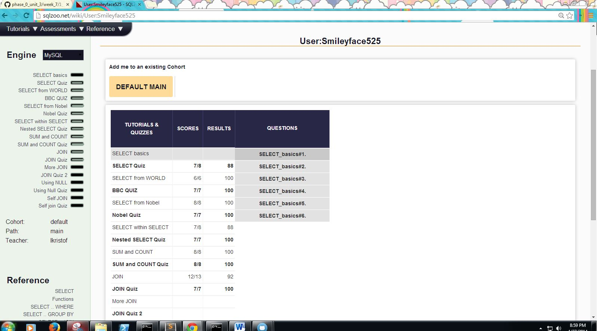

## U3.W7: SQLZoo

####I worked on this challenge by myself.

### My Quiz Results:

### Reflection

What parts of your strategy worked? What problems did you face?
-	I had to research some syataxes on my own because the tutorial didn't expalin fully on each 
    operator. 
What questions did you have while coding? What resources did you find to help you answer them?
-	Som queries were tough to come up with so I had to either do some research on my own or
    skip the question for the time being and then come back to it afterward.
What concepts are you having trouble with, or did you just figure something out? If so, what?
-	Some queries were simply hard to think of without enough explanation and practices.
Did you learn any new skills or tricks?
-	How to make queries.
How confident are you with each of the Learning Competencies?
-	Not too bad but definitely need more practice.
Which parts of the challenge did you enjoy?
-	Making queries and getting them right.
Which parts of the challenge did you find tedious?
-	Making queries and getting them wrong.