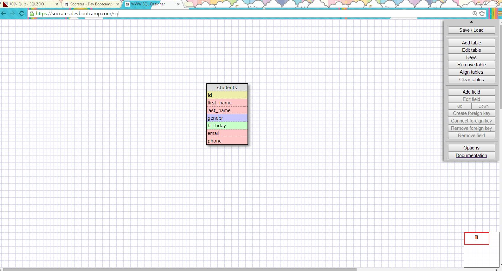
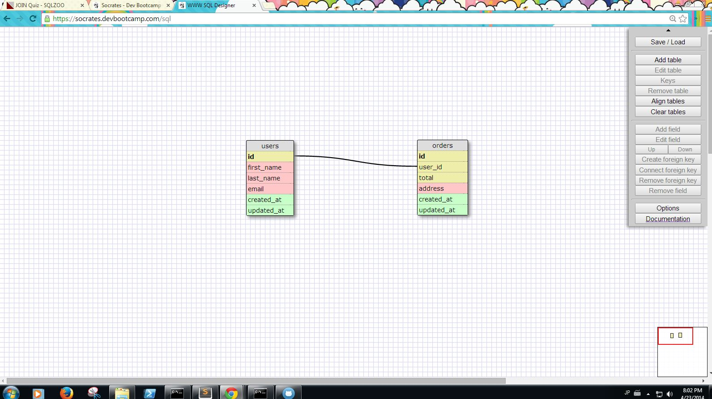
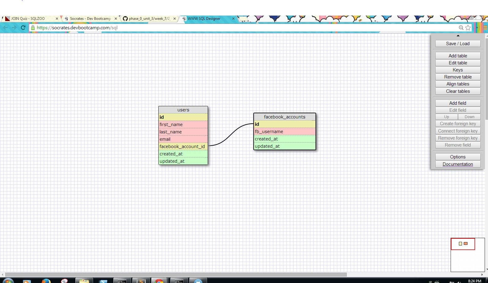
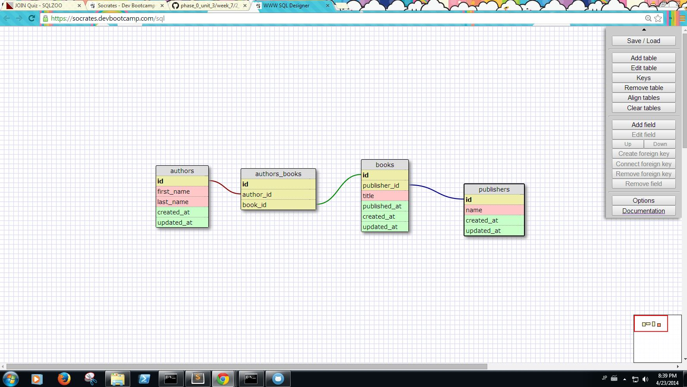
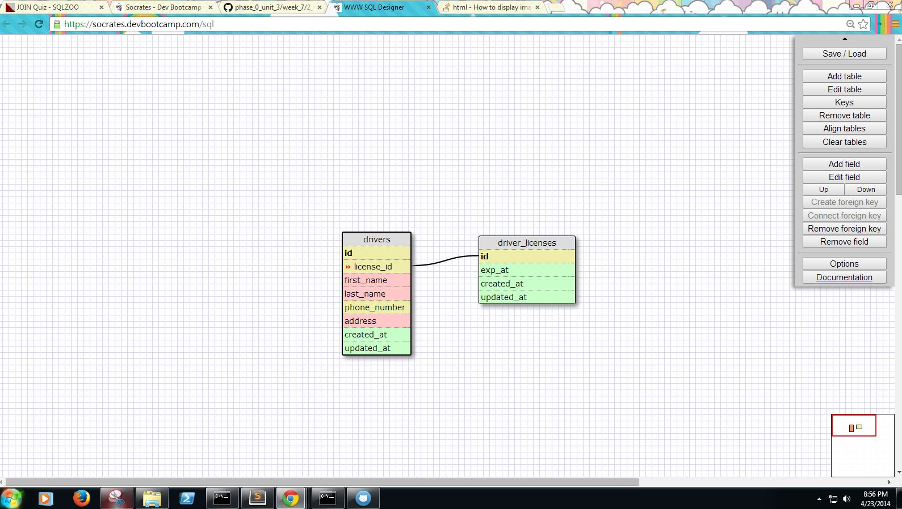
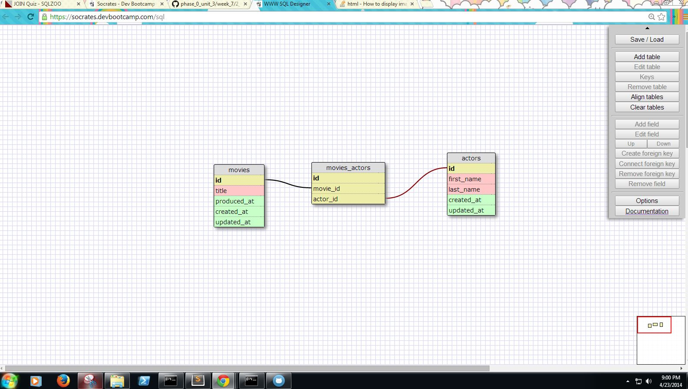

# U3.W7: Designing Schemas

#### I worked on this challenge [by myself, with: ]

## Release 0: Student Roster Schema

## Release 1: One to Many Schema

## Release 2: One to One Schema

## Release 3: Many to Many Schema

## Release 4: Design your own Schema
Description of what you're modeling: 

One to one:
These two tables represent the relationship between a driver and hid driver's license.
Only one license belongs to a driver and vice versa.

Many to many:
Two tables represent relationshiops between movies and actors.
A movie usually belongs to multiple actors and actor would have multile movies that belong to them.

## Release 5: Reflection

What parts of your strategy worked? What problems did you face?

What questions did you have while coding? What resources did you find to help you answer them?
- The challenge was fairly easy and I didn't have questions.
What concepts are you having trouble with, or did you just figure something out? If so, what?
- So far I understand the concept.
Did you learn any new skills or tricks?
- Using SQL Designer
How confident are you with each of the Learning Competencies?
- Pretty confident at thid point but I can see this concept getting pretty complicated very soon.
Which parts of the challenge did you enjoy?
- Creating schemas
Which parts of the challenge did you find tedious?
- Can't think of any. Typing, I guess.