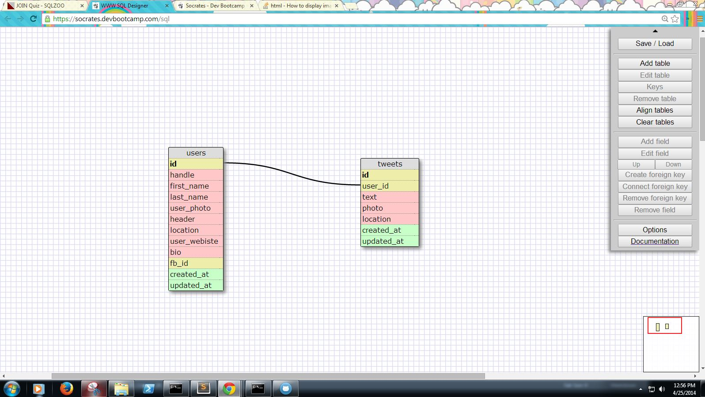

# U3.W7: Modeling a Real-World Database (SOLO CHALLENGE)

## Release 0: Users Fields

- User photo
- Header
- Name
- Location
- Website
- Bio
- Facebook account

## Release 1: Tweet Fields

- Text
- Photo
- Location

## Release 2: Explain the relationship
The relationship between `users` and `tweets` is: 
One to many. There is only one user but she can create as many tweets as she wants.

## Release 3: Schema Design

## Release 4: SQL Statements

- All the tweets for a certain user id
  Say you want all the tweets created by user with id 5.
  "SELECT id, text, photo, location FROM twitter WHERE user_id=5"

- The tweets for a certain user id that were made after last Wednesday (whenever last Wednesday was for you)
  Say you want all the tweets created by user with id 5 and the last Wednesday was on April 25th.
  "SELECT id, text, photo, location FROM tweets WHERE user_id=5 created_at > 04-24-2014 00:00:00"

- All the tweets associated with a given user's twitter handle
  Say the twitter handle was 'smileyface525'.
  "SELECT id, text, photo, locarion FROM tweets JOIN users ON tweets.user_id = users.id WHERE handle='smileyface525'" 

- The twitter handle associated with a given id
  Say the user id was 5.
  "SELECT handle FROM users WHERE id=5"

## Release 5: Reflection

- What parts of your strategy worked? What problems did you face?
	I just followed the direction.
- What questions did you have while coding? What resources did you find to help you answer them?
	I wasn't really sure how twitter worked since I had never really used it, so I did a little bit od research
	online.
- What concepts are you having trouble with, or did you just figure something out? If so, what?
	I'm still not sure how twitter's schemas are constructed and how they relate to each other especially if you 
	consider the fact that they each twitter can have unlimited number of replies and retweets.
- Did you learn any new skills or tricks?
	I didn't really learn any new tricks but I learned about how twitter works a little bit. 
- How confident are you with each of the Learning Competencies?
	Pretty confident so far.
- Which parts of the challenge did you enjoy?
	I liked the fact that this challenge was based on a actual web application. 
- Which parts of the challenge did you find tedious?
	Nothing felt tedious. If anything, the reflection.